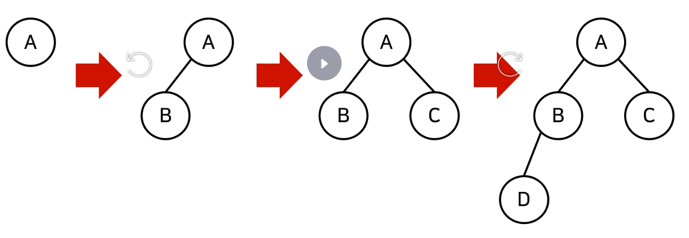
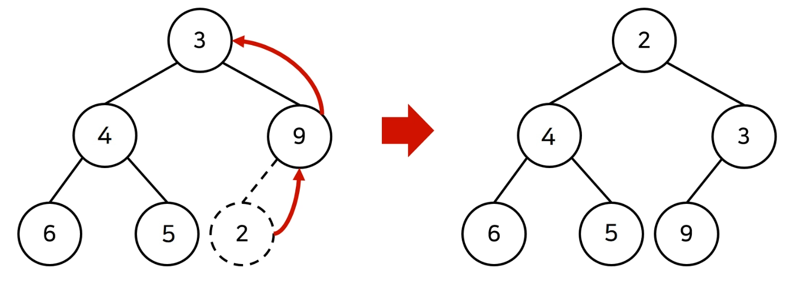
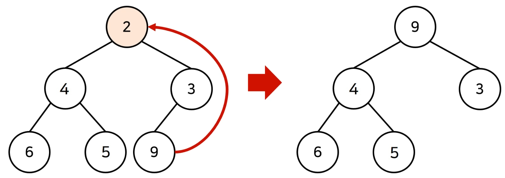
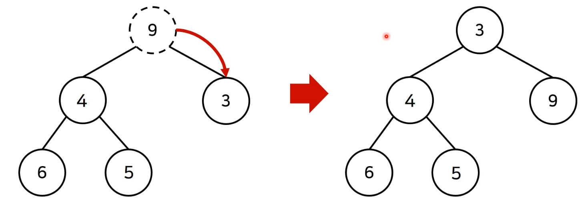

# priority-queue
우선순위 큐는 `우선순위가 가장 높은 데이터를 가장 먼저 삭제하는 자료구조`이다.

우선순위 큐는 데이터를 우선순위에 따라 처리하고 싶을 때 사용함.
- 물건 데이터를 자료구조에 넣었다가 가치가 높은 물건부터 꺼내서 확인해야 하는 경우
`우선순위 큐`

우선순위 큐를 구현하는 방법은 다양하다.
- 단순히 리스트를 이용하여 구현할 수 있다.
- 힙(heap)을 이용할 수 있다.

#### 우선순위 큐 구현 방식
|우선순위 큐 구현 방식|삽입 시간|삭제 시간|
|-|-|-|
|리스트|O(1)|O(N)|
|힙(Heap)|O(logN)|O(logN)|

단순히 N개의 데이터를 힙에 넣었다가 모두 꺼내는 작업은 정렬과 동일하다. (힙 정렬)

이 경우 시간 복잡도는 O(NlogN)이다.

### 힙(Heap)의 특징
- 힙은 완전 이진 트리 자료구조의 일종입니다.
- 힙에서는 항상 루트 노트(root node)를 제거합니다.
- 최소 힙(min heap)
    - 루트 노트가 가장 작은 값을 갖는다.
    - 값이 작은 데이터가 우선적으로 제거된다.
- 최대 힙(max heap)
    - 루트 노트가 가장 큰 값을 갖는다.
    - 값이 큰 데이터가 우선적으로 제거된다.

```
    - 9
- 3
        - 7
    - 5
        - 6
```

### 완전 이진 트리 (Complete Binary Tree)

완전 이진 트리란 루트(root) 노트부터 시작하여 왼쪽 자식 노드, 오른쪽 자식 노드 순서대로 데이터가 차례대로 삽입되는 트리를 의미합니다.



### 최소 힙 구성 함수 : Min-Heapify()
(상향식) 부모 노드로 거슬러 올라가며, 부모보다 자신의 값이 더 작은 경우에 위치를 교체합니다.


### 힙에 새로운 원소가 삽입될 때

새로운 원소가 삽입되었을 때 O(logN)의 시간 복잡도로 힙 성질을 유지하도록 할 수 있다.



### 힙에서 원소가 제거될 때
원소가 제거되었을 때 O(logN)의 시간 복잡도로 힙 성질을 유지하도록 할 수 있다.

원소를 제거할 때는 가장 마지막 노드가 루트 노드의 위치에 오도록 한다.



원소가 제거되었을 때 O(logN)의 시간 복잡도로 힙 성질을 유지하도록 할 수 있다.

이후에 루트 노드에서부터 하향식으로(더 작은 자식 노드로) Heapify()를 진행합니다.




기본 python은 min-heap 오름차순 정렬

