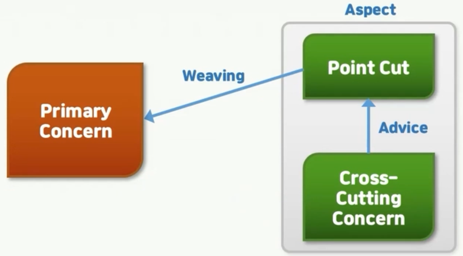

# spring

## Spring bean

speing bean과 의존 관계

1. 빈(Bean)
    - java에서 bean은 일반적으로 재사용 가능한 sw 구성요소를 의미
    - java based f/w container에서 객체를 가리킬 때 사용
    - Xml file이나 Java Configuration 파일에 Bean 설정 정보 작성
    - 의존성 주입을 통해 Bean과 상호작용 -> 느슨한 결합

2. 의존성 주입(Dependency Injection)
    - 직접 의존하는 객체를 생성하지 않고, 외부에서 의존 객체를 주입받아 사용
    - 내부에서 직접 생성하는 것이 아닌, 의존 객체를 매개변수로 전달받아 주입
    - xml, java configuration file에서 관련 빈들의 의존관계 설정
    - spring IoC container는 설정 정보를 기반으로 필요한 빈을 생성하고 의존하는 빈들을 주입하여, 객체간의 관계를 자동으로 관리
    - 객체간의 결합도를 낮춰주기에 확장성있고 유연한 설계가 가능

3. IoC(Inversion of Control)
    - 제어의 권한이 역전 되었다 하여 "제어의 역전"
    - 객체의 제어 권한을 개발자가 갖는 것이 아닌 f/w나 컨테이너에 위임
    - f/w가 대신 처리하여 객체를 제공하고 관리
    - IoC를 구현하는 방법중 하나가 바로 DI
    - IoC와 DI는 서로 연결된 개념

4.  DIP
    - 상위레벨의 모듈은 하위레벨의 모듈에 의존하지 않는다. 둘다 추상화에 의존해야한다.


5. spring bean & spring IoC Container
    - 스프링 빈 : Spring IoC Container가 관리하는 객체
    - 스프링 IoC 컨테이너
        - 빈을 관리하는 객체
        - 객체의 lifecycle 관리
        - DI를 통해 객체들 간의 관계 관리
        - 빈으로 등록된 객체 생성, 필요한 곳에서 사용될 수 있도록 제공

6. spring 의존 관계 자동 주입
    - 필드 주입 방식
        - 필드에 바로 주입하는 방식
        - 코드가 간결해짐
        - 외부에서 변경이 불가능 (test시 제약)
        - DI f/w에 종속적
        - test code에서만 보통 사용
    - setter 주입 방식 (많이 사용하지 않음)
        - setter에 의존 관계 주입
        - 선택적이고 변경 가능성이 있는 의존 관계에 주입
        - 자바빈 프로퍼티 규약의 수정자 메서드에 주입
    - 일반 메서드 주입 방식 (많이 사용하지 않음)
        - 일반 메서드를 통해서도 주입이 가능
        - 한번에 여러 필드를 주입할 수 있음
        - 정말 특이한 경우가 아니라면 사용 x
    - 생성자 주입 방식 (*권장*)
        - 스프링에서 권장하는 의존성 주입 방식
        - 대부분의 의존 관계 주입은 어플리케이션 종료까지 변경할 일 X
        - 생성자 주입 방식은 불변을 보장 (객체 생성 시 딱 1번만 생성자 호출)
        - 필요한 의존성 명시적으로 표현, 누락을 방지함
        - 테스트가 용이해짐
        - 순환 참조 문제 발생 방지

7. 여러 개 동일한 빈이 존재하면
    - @Primary : 우선순위
    - @Qualifier : 명시적

8. Bean scope
    - Singleton
        - Singleton 스코프가 기본값
        - Spring container 내에서 하나의 인스턴스만 생성되고 공유
        - 모든 요청은 동일한 instance가 반환 됨
        - spring container가 생성되는 시점에 미리 인스턴스화
        - application의 전역 공유 객체로 사용
    - Prototype (자주 사용 x)
        - 요청 마다 새로운 인스턴스가 생성
        - 요청할 때 마다 새로운 객체가 생성되고 반환
        - 스프링 컨테이너에 의해 요청이 있을 때 마다 인스턴스화
        - 상태를 가지는 객체나 스레드에 안전하지 않은 객체에 적합
    - Request
        - 웹 어플리케이션 요청 마다 새로운 인스턴스 생성
        - HTTP 요청 마다 새로운 bean 인스턴스가 생성, 해당 요청 범위 내에서 공유
        - 웹 어플리케이션의 요청 내에서 객체가 공유 되어야할 때 사용
    - Session
        - 세션당 하나의 인스턴스가 생성되는 스코프
        - 사용자 세션이 생성될 때 마다 새로운 빈 인스턴스 생성, 해당 범위 내에서 공유
        - 세션당 객체를 공유해야 할 때 사용
    - Application
        - 어플리케이션 전역에 하나의 인스턴스만 생성


## Spring Boot & DB
1. spring Boot DB 연동 : spring boot가 지원하는 DB 연동 방식
    - JDBC(Java Database Connectivity)
        1. Java에서 DB와 통신하기 위한 표준 API
        2. JDBC 드라이버를 클래스 패스에 추가하고 DB와 연동
        3. Spring Boot 에서는 자동 설정을 통해 DataSource를 구성
        4. JDBC Template 을 제공하여, 쿼리 실행 및 트랜잭션 관리
        4. application.properties or application.yml에 DB 연결 구성
    - Spring Data JDBC
        1. JDBC를 사용하여 DB와 상호작용하는 방식 중 하나
        2. 객체와 관계형 데이터베이스 간 매핑을 간단히 처리하는 기능 제공
        3. 특정 Repository 인터페이스를 작성하고 Spring Data JDBC의 
            자동 매핑 기능을 사용하여 객체를 DB에 저장하거나 조회
        4. SQL 직접 작성 X, 객체를 기반으로 DB 조작
    - NoSQL 데이터베이스
        1. Spring Boot는 NoSQL DB에 대해서도 지원
            - ex : MongoDB -> Spring Data MongoDB 지원
            - MongoDB에 대한 Repository 인터페이스와 자동 매핑 기능을 제공하여 객체를 MongoDB에 저장 및 조회
        2. NoSQL 데이터베이스에 따라 다른 방식 사용 가능
        3. 각 데이터베이스에 대한 의존성을 추가하여 연동
    - Spring Data JPA
        1. JPA (Java Persistence API) : ORM (Object-Relational Mapping)을 위한 자바 표준 인터페이스
        2. JPA를 사용하여 DB와 상호작용
        3. JPA Entity 클래스를 작성하고, JpaRepository 인터페이스를 사용하여 각종 DB 작업을 수행
        4. Spring Boot는 자동으로 EntityManagerFactory와 JPA 트랜잭션을 관리
        5. application.properties나 application.yml에 JPA 설정 구성

    - 데이터베이스 중심에서 객체중심으로 변화하고 있다.

2. JPA
    - JPA
        - Java Persistence API
        - Java 진영의 ORM 기술 표준, 즉 표준 인터페이스
            - EJB 엔티티 빈 -> 원래 제공되던 표준
            - 누군가 Hibernate를 만듦 (open source)
            - 자바의 새로운 표준 : JPA
        - JPA는 표준 인터페이스, Hibernate는 구현체 중 하나
    - ORM
        - Object-Relational Mapping
        - 객체와 관계형 데이터베이스를 매핑 해주는 역할
        - ORM 프레임워크가 객체와 관계형 DB 사이에서 매핑

JPA 동작 방식
```java
JavaApplication {
    JVM {
    
    StudentDAO -> persist(Entity객체)
    StudentDAO -> find -> return Entity객체 -> StudentDAO

        JPA {
            persist -> Entity 분석, Insert 쿼리, JDBC API 활용 RDB와 상호작용
            fine -> select 쿼리, JDBC API 활용 ResultSet 매핑 RDB와 상호작용

            JDBC API {
                
                DB와 쿼리 호출 및 응답

                persist -> DB에 Insert
                select -> DB에 select 후 응답을 받아 return

            }
        }
    }
}

쿼리 호출(Insert, select)
<=> DB { }
응답

```

3. Spring Data JPA
    1. JPA를 사용하면 좋은 이유
        1. 객체지향 설계 가능
        2. 생산성이 좋고 유지보수 편함
        3. 성능이 우수함
        4. 자바 표준
        5. 트랜잭션 관리가 용이
    2. Spring Data JPA를 사용하면 좋은 이유
        1. JPA를 좀더 편리하게 쓸 수 있음
        2. JPA Repository를 직접 구현하지 않고, 메서드의 이름 규칙을 따라 사용하면 단순한 CRUD 정도는 다 수행
        3. 커스터마이징 가능
        4. 페이징, 정렬, 동적 쿼리 처리 등 편리한 기능 제공

실습
```java

// 아래 형식으로 테이블이 그대로 만들어 진다.
@Entity
@Getter @Setter
public class Customer {
    @Id @GeneratedValue
    private Long id;
    private String name;
}

@Repository
public interface CustomerRepository extends JpaRepository<Customer, Long> {
}
```


## Spring & Transaction
1. 트랜잭션의 특징
    1. ACID 속성 : 트랜잭션에 있는 속성
        - Atomicity (원자성)
            1. 트랜잭션은 원자적인 작업 단위를 의미
            2. 트랜잭션 내의 모든 작업이 전부 수행 되거나 전혀 수행되지 않아야함
            3. 수행 중간에 오류 발생하거나 중단되어도 이전상태로 롤백되어야함
        - Consistency (일관성)
            1. 트랜잭션이 수행되기 전과 후에 데이터베이스는 일관된 상태를 유지
            2. 즉, 트랜잭션이 실행되기전에 정의된 일련의 규칙과 제약 조건들이 항상 만족되어야함
        - Isolation (고립성)
            1. 복수의 트랜잭션이 동시에 수행될 때, 각 트랜잭션은 다른 트랜잭션에 영향을 미치지 않는 독립적인 작업 단위로 간주
            2. 트랜잭션은 다른 트랜잭션의 중간 상태를 볼 수 없고, 중간 결과를 공유하거나 영향을 미칠 수 없음
        - Durability (지속성)
            1. 트랜잭션이 성공적으로 완료되면, 그 결과는 영구적으로 반영
            2. 시스템에 장애가 발생하거나 전원이 차단되어도, 트랜잭션이 커밋된 결과는 보존
            3. 데이터의 일관성을 유지하기 위해 로그 기록 등을 활용하여 데이터 복구

2. Spring Transaction 관리 방식
    - 프로그래밍적인 방식
    - 선언적인 방식

    1. 프로그래밍적인 방식
        1. 개발자가 직접 트랜잭션을 제어하는 방식
        2. 트랜잭션 시작, 종료, 롤백 등을 개발자가 명시적으로 작성
        3. 방식
            - PlatformTransactionManger : 트랜잭션 관리(시작, 종료, 롤백 등)를 담당하는 인터페이스
            - TransactionDefinition : 트랜잭션 속성(전파, 격리, 제한 시간 등)을 정의하는 인터페이스

        ```java
        @Service
        @RequiredArgsConstructor
        public class ProductService {
            private final ProductRepository productRepository;
            private final PlatformTransactionManager transactionManager;

            public void updateProductPrice(Long productId, double newPrice) {
                DefaultTransactionDefinition transactionDefinition = new DefaultTransactionDefinition();

                transactionDefinition.setPropagationBehavior(TransactionDefinition.PROPAGATION_REQUIRED);

                TransactionStatus transactionStatus = transactionManager.getTransaction(transactionDefinition);

                try {
                    Product product = productRepository.findById(productId);
                    product.setPrice(newPrice);
                    productRepository.save(product);

                    transactionManager.commit(transactionStatus);
                } catch (Exception e) {
                    transactionManager.rollback(transactionStatus);
                    throw e;
                }
            }
        }
        ```


    2. 선원적인 방식 (Annotation 이용) - 위 방식을 개선
        1. @Transactional 어노테이션을 활용, 선언적으로 트랜잭션 관리
        2. 어노테이션만 추가하면 트랜잭션 시작, 종료, 롤백 등 자동 처리
        3. 옵션을 추가하여 전파 속성, 격리 속성, 제한 시간 등 설정 가능
        4. 개발자가 직접 트랜잭션 제어코드 작성하지 않아도 됨
        5. 메서드 수준에서 트랜잭션의 경계를 명확하게 설정할 수 있음
    
        ```java
        @Service
        @RequiredArgsConstructor
        public class ProductService {
            private final ProductRepository productRepository;

            @Transactional
            public void updateProductPrice(Long productId, double newPrice) {
                Product product = productRepository.findById(productId);
                product.setPrice(newPrice);
                productRepository.save(product);
            }
        }
        ```

    3. 스프링 트랜잭션 속성 관리
        1. 트랜잭션 전파 (propagation)
            1. REQUIRED : 메서드가 호출되는 곳에서 이미 실행 중인 트랜잭션이 있으면 해당 트랜잭션에 참여, 없으면 새로운 트랜잭션 시작
            2. REQUIRED_NEW : 항상 새로운 트랜잭션 시작. 이미 실행 중인 트랜잭션 있더라도 일시 중지하고 새로운 트랜잭션 시작
            3. SUPPORTS : 메서드가 호출되는 곳에서 실행 중인 트랜잭션 있을 경우 해당 트랜잭션에 참여, 없으면 트랜잭션 없이 실행
            4. NOT_SUPPORTED : 메서드가 호출되는 곳에서 실행 중인 트랜잭션 있으면 일시 중지하고 트랜잭션 없이 실행
            5. NEVER : 메서드가 호출되는 곳에서 실행중인 트랜잭션 있으면 예외 발생
        2. 격리 레벨 (isolataion level)
            1. DEFAULT : 데이터베이스의 기본 격리 수준을 사용
            2. READ_UNCOMMITTED : 커밋되지 않은 데이터를 다른 트랜잭션에서도 읽을 수 있음 (가장 낮은 격리 수준)
            3. READ_COMMITTED : 커밋된 데이터만 다른 트랜잭션에서 읽을 수 있음 (기본 격리 수준)
            4. REPEATABLE_READ : 같은 데이터를 여러 번 읽어도 결과가 항상 일관성 있음
            5. SERIALIZABLE : 동시에 실행되는 트랜잭션들이 순차적으로 실행되는 것처럼 결리 (가장 높은 격리 수준)


## Spring TEST
1. 테스트 주도 개발
2. JUnit5
3. Spring 실무 Test Code

### 1. 테스트 주도 개발

#### TDD
- Test Driven Development(테스트 주도 개발)
- 테스트 코드를 먼저 짜는 방식
- 해당 테스트를 통과할 수 있도록 실제 코드 작성
- 개발 시 설계와 일치하는 결과를 도출할 수 있음
- 팀원 간 개발 방향 일치


#### 1. 테스트의 종류
1. 유닛(단위) 테스트 - 개발자 테스트
2. 통합 테스트 - 개발자 참여 테스트
3. 인수 테스트

#### 2. 테스트 코드를 작성하는 목적
1. 코드의 안정성을 높일 수 있음
2. 기능 추가나 변경 시 사이드 이팩트를 최소화
3. 코드의 작성된 목적을 정확하게 알려줌
    - 코드에 불필요한 요소를 넣을 확률 감소
    - 팀원 간 정확한 개발 방향 공유


#### 3. F.I.R.S.T 원칙
1. Fast : 테스트 코드의 실행은 빠르게 진행
2. Independent : 독립적인 테스트가 가능해야 함
3. Repeatable : 테스트는 매번 같은 결과를 만들어야 함
4. Self-Validating : 테스트는 그 자체로 실행하여 결과를 확인할 수 있어야 함
5. Timely : 단위 테스트는 비즈니스 콛가 완성되기 전에 구성하고 테스트 가능해야 함


### 2. JUnit
#### 1. 개념
1. 자바 진영의 대표적인 테스트 F/W
2. 단위 테스트를 위한 다양한 도구를 제공
3. 어노테이션 기반으로 동작
4. 어설트를 이용해 실젯값과 기댓값을 비교하여 결과 확인
5. JUnit5는 Jupiter, Platform, Vintage 모듈로 구성
#### 2.Junit5 주요 모듈
- junit-jupiter
    1. JUnit5의 핵심 모듈, 주요 기능들을 제공
    2. 테스트 실행, Assertion, Parameterized Test, 테스트 인스턴스 라이프 사이클 관리 등을 지원
- junit-vintage
    1. JUnit4와 호환성을 제공하기 위한 모듈
    2. JUnit4 기반의 테스트 코드를 실행할 수 있도록 도와줌
    3. JUnit4 + JUnit5 기능을 혼합해서 사용 가능
- junit-platform-commons
    1. JUnit Platform의 공통 기능을 제공하는 모듈
    2. 유틸리티, 어노테이션, 테스트 실행 관리 기능 등을 제공
- junit-platform-engine
    1. JUnit Platform의 엔진 API를 제공하는 모듈
    2. 다양한 실행환경에서 JUnit5가 실행될 수 있도록 도와주는 역할
    3. 이 모듈을 이용하면 다른 테스트 엔진과 통합하여 사용 가능

#### 3. JUnit Annotation - Lifecycle Annotation
1. @Test : 테스트용 메서드를 표현하는 어노테이션
2. @BeforeEach : 각 테스트 메서드가 시작되기 전 실행 되어야하는 메서드 표현
3. @AfterEach : 각 테스트 메서드가 시작된 후 실행 되어야 하는 메서드 표현
4. @BeforeAll : 테스트 시작 전에 실행 되어야하는 메서드 (static 처리 필요)
5. @AfterAll : 테스트 종료 후에 실행 되어야하는 메서드 (static 처리 필요)

#### 4. JUnit Annotation - Main Annotation
- @SpringBootTest
    1. 통합 테스트 용도로 사용되는 어노테이션
    2. @SpringBootApplication을 찾아가 하위의 모든 Bean을 스캔하여 로드
    3. 이후 테스트용 Application Context를 만들어 Bean을 추가하고, MockBean을 찾아가 교체
- @ExtendWith
    1. JUnit4에서 @RunWith로 사용되던 어노테이션이 ExtendWith로 변경
    2. 메인으로 실행될 클래스를 지정
    3. @SpringBootTest는 디폴트로 @ExtendWith가 추가 되어있음
- @WebMvcTest([클래스명].class)
    1. 명시된 클래스만 실제로 로드하여 테스트
    2. 매개변수 없이 작성하면 @Controller, @RestController, @RestControllerAdvice 등 컨트롤러와 관련된 Bean이 로드
    3. 스프링의 모든 Bean을 로드하는 @SpringBootTest 대신 컨트롤러 관련 코드만 테스트할 때 사용
- @AutoConfigureMockMvc
    1. spring.test.mockmvc의 설정을 로드하면서, MockMvc의 의존성을 자동으로 주입
    2. MockMvc 클래스 REST API를 테스트할 수 있는 클래스
- @AutoWired
    1. 필요한 의존 객체의 타입에 해당하는 Bean을 찾아 주입
    2. @SpringBootTest에 의해 띄워진 Bean들 중 찾아서 주입
        - 이미 구현된 내용을 사용함
- @MockBean
    1. 테스트할 클래스에서 주입받고 있는 개체에 대해 가짜 객체를 생성해주는 어노테이션
    2. 해당 객체는 실제 행위를 하지 않음
    3. 내부의 구현을 테스트를 사용하는 사용자에게 위임


### 3. 스프링 실무 테스트 코드
1. Controller
```java
@WebMvcTest(HelloController.class)
class HelloContollerTest {
    @Autowired private MockMvc mockMvc;
    @MockBean HelloServiceImpl helloService;

    // Get방식 테스트
    @Test
    void getStudentTest() throws Exception {
        given(helloService.getStudent("kim")).willReturn(new StudentDto("kim"));

        String name = "kim";

        mockMvc.perform(get("/hello/v1?name="+name))
            .andExpect(status().isOk())
            .andExpect(jsonPath("$.name").value("kim"))
            .andDo(print());

        verify(helloService).getStudent("kim");
    }

    // Post 방식 테스트
    @Test
    void postStudentTest() throws Exception {
        given(helloService.saveStudent("kim")).willReturn(new StudentDto("kim"));

        StudentDto testStudent = new StudentDto("kim");

        String testJson = new ObjectMapper().writeValueAsString(testStudent);

        mockMvc.perform(
            post("/hello/v1")
                .content(testJson)
                .contentType(MediaType.APPLICATION_JSON)
            )
            .andExpect(status().isOk())
            .andExpect(jsonPath("$.name").value("kim"))
            .andDo(print());

        verify(helloService).saveStudent("kim");
    }

}
```

2. Service
```java
@SpringBootTest(classes = {HelloServiceImpl.class, HelloRepository.class})
class HelloServiceImplTest {
    @MockBean HelloRepository helloRepository;  // 가정한다.
    @Autowired HelloServiceImpl helloService;

    @Test
    public void getStudentTest() {
        Student student = new Student();
        student.setName("kim");
        when(helloRepository.findByName("kim")).thenReturn(Optional.of(student)); // 가정

        StudentDto studentDto = helloService.getStudent("kim");

        assertEquals("kim", studentDto.getName());
        assertThat("kim").isEqualTo(studentDto.getName());

        verify(helloRepository).findByName("kim");
    }

    @Test
    public void saveStudentTest() {
        Student student = new Student();
        student.setName("kim");
        when(helloRepository.save(student)).thenReturn(student); // 가정

        StudentDto studentDto = helloService.saveStudent("kim");

        assertEquals("kim", studentDto.getName());
        assertThat("kim").isEqualTo(studentDto.getName());
    }
}
```


## Spring AOP
1. 관점 지향 프로그래밍
2. Spring AOP

### 1. 관점 지향 프로그래밍
- AOP
    - Aspect-Oriented Programming
    - AOP를 활용하여 핵심 기능과 부가 기능을 분리
    - AOP는 OOP를 더욱 잘 지킬 수 있게 보완

1. 관점 지향 프로그래밍

    commerce application
    - 회원관리(로깅, 보안, 트랜잭션)
    - 주문관리(로깅, 보안, 트랜잭션)
    - 상품관리(로깅, 보안, 트랜잭션)
    - 핵심기능(부가기능)

    공통적인 것만 모아서 모듈화한 것이 AOP

### 2. Spring AOP
1. AOP 구성요소
    1. Target : 어떤 대상에 부가기능을 부여할 것인가?
    2. Advice : 어떤 부가기능을 제공할 것인가?
        - Before, AfterReturning, AfterThrowing, After, Around
    3. Join Point : 어디에 적용할 것인가?
        - Method(★), Field, Object, Constructor
    4. Point cut : 실제 advice가 적용될 지점
        - Spring AOP에서는 advice가 적용될 메서드를 선정

2. AOP 구현 방법
    1. 컴파일 시점 : 코드에 공통 기능 삽입
    2. 클래스 로딩 시점 : 바이트 코드에 공통 기능 삽입
    3. 런타임 시점에 프록시 객체를 생성하여 공통 기능 삽입
        - Spring에서 사용하는 방식
        - 컴파일러나 클래스 로더 조작기 설정할 필요가 없음
        - 메서드 오버라이딩 방식으로, 메서드 실행시점에만 AOP 적용 가능
        - Spring 컨테이너가 관리할 수 있는 빈에만 AOP 적용
        - AspectJ를 직접 사용 X, AspectJ의 기능을 차용

3. AOP 동작 방식


