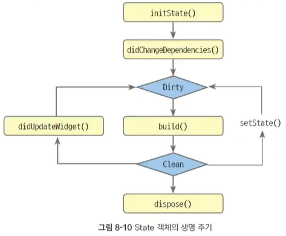

# 3. User Interface

## 08-1, 2 위젯, 위젯 트리

플러터의 위젯은 화면과 관련된 모든 것을 말하며 위젯은 불변이다.

- 선언형 UI 프로그래밍

객체 선언에 정보만 전달해준다.

플러터에서는 위젯 트리를 갖는다. 계층 구조로 layout이 짜인다고 볼 수 있다. 그리고 내부적으로는 3개의 트리를 갖는다.

위젯 트리 -> 엘리먼트 트리 -> 렌더 트리

위젯 트리 : 개발자가 선언한 것

엘리먼트 트리 : 화면을 보이기 위한 객체 트리

렌더 트리 : 실제 화면으로 보이게 하는 트리, 위젯 개수와 다를 수 있다.


## 08-3. 위젯 종류

Widget
- StatelessWidget
- StatefulWidget
- 상속 위젯

보통 Stateless, Stateful을 사용하는데 Stateful은 상태(data)가 변화하는 것을 re-rendering해줄 때 사용한다. 개발할 때 무조건 statefulWidget만 사용하지 않는다.

#### StatefulWidget
statefulWidget은 state 클래스를 갖는다. setState라는 함수로 re-rendering할 수 있도록 한다.

위젯은 불변하다. 그래서 다시 생성할 수 있는 구조로 관리된다. 변하는 값에 대해서는 메모리에 저장 시켜두고 변한 값만 확인해서 메모리에서 값만 변경시키기 위해 따로 클래스를 뺀 것이다. 그게 state 클래스고 거기서만 변경이 이루어지도록 한다. setState() 함수를 사용해서 re-rendering 하도록 한다.

## 08-4.정적 화면, 동적 화면 예제 점검
## 08-5. 상태의 생명 주기 (State Class)



주로 재 정의 되는 함수
- build() : 화면 rendering 때문에 필수★
- initState() : 자주 사용, 객체 생성되자 마자 가장 먼저 최초 한번 호출, 자신들의 상태값 초기화, 초기값 세팅, 이벤트(이벤트 리스너-핸들러) 등록
- setState() : State의 상태(data)를 변경할 때 호출하는 함수
- Clean : state에 의해 화면이 출력되고 있는 정상 상태
- Dirty : 화면에 반영되지 않은 상태, State 화면을 다시 빌드해야 하는 상태
- didChangeDependencies() : 상위 위젯에서 하위 위젯으로 변경된 상태를 전달할 때 호출된다.
- didUpdateWidget() : 상태가 변화될 때를 감지할 때 호출한다. 여기서 build()를 호출한다고 한다.
- dispose() : 자주 사용, 객체가 메모리에서 소멸될 때 마지막으로 실행되는 함수


## BuildContext

Widget은 BuildContext를 갖는다. BuildContext는 __위젯 객체의 정보__ 를 갖고 있으며 상위 위젯에도 접근을 할 수가 있다. 그렇지만 이것은 좋은 방법은 아님.

Widget은 Key를 가질 수 있다. stateless에는 크게 상관이 없을 수도 있다. stateful에도 서로 다른 클래스를 사용하면 상관없을수 있다. 하지만 목록형에 stateful을 쓸 때 서로 다른 객체임을 알리려면 __키(Key)__ 를 부여해야 한다.


## 09-1. asset

image, text 등의 파일 resources

pubspec.yaml 파일에 flutter.aseets 에 리소스 경로들, assets 경로들을 설정한다.

폴더 경로 지정 예시

assets 경로(Path)는 플러터 프로젝트의 루트부터 시작한다. `lib` directory와 같은 레벨에 위치한다.

```yaml
# pubspec.yaml
flutter:
    assets:
        - resources/images/
        - resources/images/icon/
        - resources/assets/text/
```

예제 소스
```dart
// test.dart
import 'package:flutter/material.dart';
import 'package:flutter/services.dart';

void main() {
  runApp(MyApp());
}
class MyApp extends StatelessWidget {
  // 미래 발생할 타입 : Futrue
  Future<String> useRootBundle() async {
    return await rootBundle.loadString('resources/assets/text/my_text.txt');
  }
  Future<String> useDefaultAssetBundle(BuildContext context) async {
    return await DefaultAssetBundle.of(context).loadString("resources/assets/text/my_text.txt");
  }
  @override
  Widget build(BuildContext context) {
    return MaterialApp(
      home: Scaffold(
        appBar: AppBar(
          title: Text("test"),
        ),
        body: Column(
          children: [
            Image.asset("resources/images/icon.jpg"),
            Image.asset("resources/images/icon/user.png"),
            FutureBuilder(
                future: useRootBundle(),
                builder: (context, snapshot ) {
                  return Text("rootBundle : ${snapshot.data}");
                }
            ),
            FutureBuilder(
                future: useDefaultAssetBundle(context),
                builder: (context, snapshot ) {
                  return Text("DefaultAssetBundle : ${snapshot.data}");
                }
            )
          ],
        ),
      ),
    );
  }
}
```

## 09-2. Text Widget

문자열을 출력하는 위젯

텍스트 위젯 생성자
```dart
Text(String data, { ... (생략) ... })
Text.rich(InlineSpan textSpan, { ... (생략) ... })
```

#### 텍스트 정렬하기 - textAlign

문자열 정렬 textAlign 속성

TextAlign 클래스가 클래스가 제공하는 상수로 가로 방향 정렬 방법을 지정한다.

상수는 start, end, center, left, right 등을 제공한다.

텍스트 정렬하기
```dart
Text('Hello World'),
Text(
  'Hello World',
  textAlign: TextAlign.center,
),
```

#### 텍스트 스타일 지정하기 - TextStyle

텍스트 스타일 지정하기

#### 줄 수 제한하기 - maxLines

텍스트에 긴 문자열을 출력하면 자동으로 줄 바꿈해서 여러 줄로 출력

줄임표시 같은 게 가능하다.

텍스트 위젯 예제
```dart
import 'package:flutter/material.dart';

void main() {
  runApp(MyApp());
}

class MyApp extends StatelessWidget {
  String longTxt = "가나다라마바사 가나다라마바사 가나다라마바사 가나다라마바사 가나다라마바사 가나다라마바사12 가나다라마바사 가나다라마바사 가나다라마바사 가나다라마바사 가나다라마바사 가나다라마바사 ";
  @override
  Widget build(BuildContext context) {
    return MaterialApp(
      home: Scaffold(
        appBar: AppBar(title: Text("test"),),
        body: Column(
          crossAxisAlignment: CrossAxisAlignment.stretch,
          children: [
            Text(
              'Hello World',
              style: TextStyle(
                fontWeight: FontWeight.bold,
                fontStyle: FontStyle.italic,
                color: Colors.red,
                fontSize: 20,
                height: 2,
                backgroundColor: Colors.yellow,
                decoration: TextDecoration.underline,
                decorationColor: Colors.red,
                decorationStyle: TextDecorationStyle.wavy
              ),
            ),
            Text(
              longTxt,
              style: TextStyle(
                fontSize: 20,
              ),
              maxLines: 2,
              overflow: TextOverflow.fade,
            ),
            RichText(
                text: TextSpan(
                  text: "HE",
                  style: TextStyle(fontSize: 20, color: Colors.black),
                  children: [
                    TextSpan(
                      text: "L",
                      style: TextStyle(fontStyle: FontStyle.italic),
                      children: [
                        TextSpan(text: 'KO'),
                        TextSpan(
                          text: "WO",
                          style: TextStyle(color: Colors.red),
                        ),
                      ]
                    ),
                    TextSpan(
                      text: 'RLD',
                      style: TextStyle(fontWeight: FontWeight.bold)
                    )
                  ]
                )
            )
          ],
        ),
      ),
    );
  }
}
```


## 09-3. 이미지 위젯

이미지를 출력할 때는 image 위젯을 사용. 그런데 Image 위젯으로 출력할 데이터는 ImageProvider로 가져와야 한다.

ImageProvider는 추상 클래스이며 이 클래스를 상속받은 다음의 클래스를 이용한다.

- AssetImage : 에셋 이미지
- FileImage : 파일 이미지
- MemoryImage : 메모리의 데이터 이미지
- NetworkImage : 네트워크의 이미지
- ResizeImage : 이미지 크기 변경

에셋 이미지를 AssetImage로 가져와 Image 위젯으로 출력하는 코드는 다음처럼 작성한다.

```dart
Image(image: AssetImage('images/icon/user.png'),),
```

ResizeImage는 이미지 크기를 변경
```dart
Image(image: ResizeImage(AssetImage('images/icon/user.png'), width: 70, height: 80)),
```

이미지 위젯에 이미지를 채우는 방식 BoxFit 클래스 사용.

이미지 위젯 사용 예제
```dart
import 'package:flutter/material.dart';

void main() {
  runApp(MyApp());
}
class MyApp extends StatelessWidget {
  @override
  Widget build(BuildContext context) {
    return MaterialApp(
      home: Scaffold(
        appBar: AppBar(title: Text('Test'),),
        body: Column(
          children: [
            Image(image: NetworkImage('https://picsum.photos/250?image=9')),
            Container(
              color: Colors.red,
              child: Image.asset(
                'resources/images/big.jpeg',
                width: 200,
                height: 200,
                fit: BoxFit.fill,
              ),
            )
          ],
        ),
      ),
    );
  }
}
```

## 09-4. icon & icon button

플러터에서 아이콘을 대부분 지원한다.

```dart
import 'package:flutter/material.dart';
import 'package:font_awesome_flutter/font_awesome_flutter.dart';

void main() {
  runApp(MyApp());
}
class MyApp extends StatelessWidget {
  onPressed() {
    print('icon button click...');
  }
  @override
  Widget build(BuildContext context) {
    return MaterialApp(
      home: Scaffold(
        appBar: AppBar(title: Text('test'),),
        body: Column(
          children: [
            Icon(
              Icons.alarm,
              size: 100,
              color: Colors.red,
            ),
            FaIcon(
              FontAwesomeIcons.bell,
              size: 100,
            ),
            IconButton(onPressed: onPressed, icon: Icon(Icons.alarm, size: 100,))
          ],
        ),
      ),
    );
  }
}
```

## 09-5 Gesture Detector & Elevate Button

JestureDetector example
```dart
GestureDetector (
  child: Image.asset('images/icon/user.png'),
  onTap: () {
    print('image click..');
  },
)
```
#### 엘리베이트 버튼 -ElevateButton

보통 버튼에서 많이 사용하는 위젯

```dart
ElevateButton(
  onPressed : () {
    print('ElevatedButton click..');
  },
  child : Text('Click Me'),
)
```

## 09-6. 컨테이너와 센터 위젯

#### Container

Container는 화면 영역을 표현하는 위젯이다. 자체 화면 갖지 않고 child로 Container 영역에 표시할 위젯을 지정할 수 있다. 특정 영역의 margin, border, padding 등 지정할 수 있고 배경 색상, 배경 이미지 등 다양하게 꾸미는 방법을 제공한다.

#### 가운데 정렬하는 센터 - Center

대부분 특정 영역에 가운데에 배치하는 경우에 Center를 많이 사용한다.


## 10-1. 방향 설정하기

가로 배치 Row

세로 배치 Column

방향의 기본축, 교차축이 존재한다.
main, cross

#### Row, Column 기본 사이즈 
- main 축 사이즈 최대 지정
- crss 축 사이즈 최소 지정

메인축 사이즈

MainAxisSize
- min, max

배치 설정하기 - alignment
- MainAxisAlignment
- CrosAxisAlignment


### stack

add된 순서대로 겹쳐져 나오는 것

여러 위젯을 겹쳐서 나오도록 하는 것

### indexedStack

위젯 스택 중에서 특정 인덱스 위젯만 나오도록 함.

## 10-2. 위치 설정하기

Row, Column을 이용해 위젯을 배치하면 순서대로 가로, 세로 방향으로 배치된다. Stack은 특정 위치를 설정해야 할 때가 많다. 이 때 Align과 Positioned 위젯을 사용한다. Align은 Stack뿐만 아니라 독립적으로 사용할 수 있지만, Positioned는 Stack에서만 사용할 수 있다.

`특정 위치에 배치 - Align`

다음 코드는 Align 위젯에 alingment값을 Alignment.topRight로 설정하여 위젯이 화면의 오른쪽 윗부분에 위치하는 코드다. Align 위젯은 독립적으로 사용해도 되고 Stack과 함께 사용해도 된다.

```dart
Align(
  alignment: Alignment.topRight,
  child: Container(
    color: Colors.red,
    width: 100,
    height: 100,
  ),
)
```
Alignment 클래스에 정의된 center, bottomRight 등의 상수로 위젯의 위치를 설정할 수 있지만, Alignment 생성자의 매개변수에 숫자를 넘겨 위치를 설정할 수도 있다.
```dart
// Alignment 생성자
Alignment(double x, double y)
```
x, y에는 -1.0~1.0 까지 값을 설정할 수 있고 0.0은 사각형의 중앙이다. -1.0은 X축 왼쪽 Y축 위를 의미하며, 1.0은 X축 오른쪽 Y축 아래를 의미한다.


### 왼쪽 위를 기준으로 배치하기 - FractionalOffset

```dart
Align(
  alignment: FractionalOffset(0.5, 0.5), // 중앙값
)
```

### 상대 위칫값으로 배치하기 - Positioned

부모 위젯 기준에서 left, top 등의 속성 값으로 배치한다.
```dart
Positioned(
  left: 40.0,
  top: 40.0,
  child: Container(
    width: 150,
    height: 150,
    color: Colors.pink,
  )
)
```

## 10-3. 사이즈 설정

위젯은 각각 사이즈를 설정할 수 있다. 

### 똑같은 크기로 배치하기 - IntrinsicWidth, IntrinsicHeight
IntrinsicWidth, IntrinsicHeight는 Row나 Column에 추가한 여러 위젯의 크기를 똑같이 설정할 때 사용한다. Intrinsic을 사용하면 크기가 가장 큰 것을 기준으로 모두 통일할 수 있다.

### 최소, 최대 범위로 배치하기 - ConstrainedBox
위젯의 최소, 최대 범위 지정하여 사이즈 정한다.

```dart
// 최대로 확장
ConstrainedBox(
  constraints: BoxConstraints.expand()
)
```

```dart
// 마지노선 설정
ConstrainedBox(
  constraints: BoxConstraints(
    minWidth: 300,
    maxHeight: 50
  ),
  child: Container(color: Colors.red, width: 150, height: 150.0),
)
```


## 10-4. 기타 배치와 관련된 위젯

비율로 배치하기 - Expended

Expended를 사용하면 각 위젯 사이즈가 무시된다. 위젯 크기가 비율로 계산된다.

비율값은 flex 속성값으로 설정할 수 있다.

★ 빈 공간 넣기 - Spacer : 인스타 화면처럼 공간 부여 가능하다.
Row에 공간 부여할 떄 사용. 빈 공간 넣기.


스크롤 제공하기 - SingleChildScrollView : 하위 하나만 갖는다.

```dart
import 'package:flutter/material.dart';

void main() {
  runApp(MyApp());
}
class MyApp extends StatelessWidget {
  @override
  Widget build(BuildContext context) {
    return MaterialApp(
      home: Scaffold(
        appBar: AppBar(title: Text('Test'),),
        body: SingleChildScrollView(
          scrollDirection: Axis.vertical,
          child: Column(
            children: [
              Container(
                height: 300,
                child: Row(
                  children: [
                    Container(
                      color: Colors.red,
                      width: 100,
                    ),
                    Expanded(
                        flex: 1,
                        child: Container(
                          color: Colors.amber,
                        )
                    ),
                    Expanded(
                        flex: 1,
                        child: Container(
                          color: Colors.yellow,
                        )
                    )
                  ],
                ),
              ),
              Container(
                color: Colors.green,
                height:300,
                child: Row(
                  children: [
                    Image.asset("resources/images/lab_instagram_icon_1.jpg"),
                    Image.asset("resources/images/lab_instagram_icon_2.jpg"),
                    Image.asset("resources/images/lab_instagram_icon_3.jpg"),
                    Spacer(),
                    Image.asset("resources/images/lab_instagram_icon_4.jpg"),
                  ],
                ),
              ),
              Container(
                color: Colors.blue,
                height: 300,
              )
            ],
          ),
        ),
      ),
    );
  }
}
```

## 11-1. 사용자 입력 처리 위젯

input

텍스트 필드 : TextField

입력된 데이터 얻기 : TextEditingController

텍스트 필드에 controller를 지정만 하면 자동저장된다.

### 꾸미기 - InputDecoration

### 액션 버튼 - textInputAction
우측 하단 키를 무엇으로 쓸 것인지 지정할 수 있음.

### 키보드 유형 - keyboardType

### 텍스트 감추기 - obscureText

### 여러 줄 입력 - maxLines, minLines


## 11-2. checkbox, radio button, slider, switch

checkbox, radio button, slider, switch 이 모두 사용자에게 데이터를 입력받는 위젯.

example

### Checkbox
```dart
Row(
  children: [
    Checkbox(
      value: isChecked,
      onChangd: (bool? value) {
        setState(() {
          isChecked = value;
        });
      }
    ),
    Text('checkbox value is $isChecked')
  ],
)
```

### Radio button
```dart
Row(
  children: [
    Radio(
      value: 'android',
      groupValue: selectPlatform, // 
      onChanged: (String? value) {
        setState(() {
          selectPlatform = value;
        });
      }
    )
  ]
),
Row(
  children: [
    Radio(
      value: 'ios',
      groupValue: selectPlatform, //
      onChanged: (String? value) {
        setState(() {
          selectPlatform = value;
        });
      }
    )
  ]
)
```

### Slider

slider 위젯은 min, max 속성으로 값을 설정하며 사용자가 막대를 왼쪽, 오른쪽으로 밀면 그 사이 값이 onchanged에 지정한 함수의 매개변수에 전달된다.

```dart
// 슬라이더 출력
Slider(
  value: selectValue,
  min: 0,
  max: 10,
  onChanged: (double value) {
    setState(() {
      selectValue = value;
    });
  }
),
```

### Switch
true / false 를 입력받는 위젯 : 주로 활성/비활성 상태를 선택받을 때 사용한다.

```dart
Switch(
  value: selectValue,
  onChanged: (bool value) {
    setState(() {
      selectValue = value;
    });
  }
),
```

## 11-3 Form 이용하기

입력에 있어서 유효성 검증이 필요하다. 유효성 검증은 개발자 알고리즘
- 유효한지 아닌지 검증
- 유효성에 따른 메시지 뿌리기 등

Form Widget을 이용하면 어느정도 도움을 받을 수 있다.

Form 위젯 그리고 하위의 `FormField<TextField>`를 사용한다.

```
Form
- FormField<TextField>
```

또는 위 클래스를 추상화한 TextFormField를 사용할 수 있다.

Form을 사용할 때 키를 선언해야 한다. 그리고 key를 맵핑한다.
- Form -> key -> State

form field를 사용할 때 유효성 검증 속성을 사용한다.
- validator 속성

Form.validate() 함수를 호출하면 Form 하위의 FormField 속성에 선언된 validator에 등록된 개발자 함수들이 전체 실행된다.

validator 속성에서 return null; 은 유요하다고 본다. 문자열을 return 하면 유효하지 않다고 본다.

- 검증 통과는 null return
- 검증 무효는 문자열 -> 에러메시지 return
- validator 모두가 null 을 return 하면, validate() 가 true를 뱉고, 그렇지 않으면 false를 뱉는다.
- validate() -> true -> save()
- save() 함수가 호출되면 모든 개별 Field의 onSaved : 개발자 함수가 수행된다.

```dart
import 'package:flutter/material.dart';

void main() {
  runApp(MyApp());
}
class MyApp extends StatelessWidget {
  @override
  Widget build(BuildContext context) {
    return MaterialApp(
      home: Scaffold(
        appBar: AppBar(
          title: Text('Test'),
        ),
        body: TestScreen(),
      ),
    );
  }
}
class TestScreen extends StatefulWidget {
  @override
  State<StatefulWidget> createState() {
    return MyFormState();
  }
}
class MyFormState extends State<TestScreen> {
  final _formKey = GlobalKey<FormState>();
  String? firstName;
  String? lastName;
  @override
  Widget build(BuildContext context) {
    return Column(
      children: [
        Text("Form Test"),
        Form(
          key: _formKey,
          child: Column(
            children: [
              TextFormField(
                decoration: InputDecoration(
                  labelText: 'FirstName',
                ),
                validator: (value) {
                  if(value?.isEmpty ?? false) {
                    return "Please enter first name";
                  }
                  return null;
                },
                onSaved: (String? value) {
                  firstName = value;
                },
              ),
              TextFormField(
                decoration: InputDecoration(
                  labelText: 'LastName',
                ),
                validator: (value) {
                  if(value?.isEmpty ?? false) {
                    return "Please enter last name";
                  }
                  return null;
                },
                onSaved: (String? value) {
                  lastName = value;
                },
              )
            ],
          ),
        ),
        ElevatedButton(
            onPressed: () {
              if(_formKey.currentState?.validate() ?? false) {
                _formKey.currentState?.save();
                print('firstName : $firstName, lastName : $lastName');
              }
            },
            child: Text("submit")
        )
      ],
    );
  }
}
```

## 12-1. List View

리스트 뷰
- 여러 위젯을 세로나 가로로 나열하면서 화면을 벗어날 때 스크롤을 지원하고자 사용하고, 일반 목록 화면처럼 항목을 나열하고자 사용한다. 
- 리스트 뷰는 화면 스크롤을 지원한다.

가로 스크롤을 적용하려면 아래 속성을 적용한다.

`scrollDirection: Axis.horizontal,` 

### 목록 구성하기

ListView(), ListView.builder()를 이용해도 된다. 다만, ListView() 생성자 사용할 시 항목이 많아지는 것은 주의해야 한다.

스크롤할 때 보이지 않던 항목을 준비해서 나오게 하면 효율적이다.


#### 항목을 스크롤에 따라 불러오기 - ListView.builder()
ListView.builder() 생성자에는 itemCount와 itemBuilder라는 속성을 설정한다. 
- itemCount : 리스트 뷰에 출력할 항목 수
- itemBuilder : 항목을 구성하는 위젯을 만들어 주는 함수

*itemCount에 100을 설정하여도 itemBuilder에 지정한 항목 위젯을 만드는 함수가 처음부터 100번 호출되지는 않는다. 처음 화면에 나올 개수만큼만 호출되며 이후 스크롤이 발생해 항목이 더 필요해지면 그때 다시 호출된다.


#### 항목 구분자 설정하기 - ListView.seperated()
ListView.seperated() 생성자는 itemCount와 itemBuilder를 이용해 항목의 개수와 항목을 구성하는 위젯을 지정한다는 면에서 ListVuew.builder()와 같다. but ListVuew.builder()는 항목 구분자를 나타내는 별도의 속성을 제공하지 않는다. 물론 itemBuilder에 지정하는 함수에서 구분자 역할을 하는 위젯을 따로 준비해도 되지만, ListView.seperatred() 생성자를 이용하면 항목 구분자를 조금 더 쉽게 지정할 수 있다.

ListView.seperated() 생성자의 seperatorBuilder 속성 지정하는 함수에서 구분자로 사용할 위젯을 반환하면 된다. 
- Divider 위젯 주로 사용 (가로선)


#### 항목 구성 - ListTile
리스트에서 여러 위젯을 사용할 수 있지만 복잡한 것을 구성할 때 ListTile위젯을 사용하면 편리하다.

```dart
import 'package:flutter/material.dart';

void main() {
  runApp(MyApp());
}
class User {
  String name;
  String phone;
  String email;
  User(this.name, this.phone, this.email);
}
class MyApp extends StatelessWidget {
  List<User> users = [
    User('홍길동', '01001', 'a@a.com'),
    User('김길동', '01001', 'a@a.com'),
    User('고길동', '01001', 'a@a.com'),
    User('이길동', '01001', 'a@a.com'),
    User('박길동', '01001', 'a@a.com'),
    User('지길동', '01001', 'a@a.com'),
    User('하길동', '01001', 'a@a.com'),
    User('최길동', '01001', 'a@a.com'),
    User('주길동', '01001', 'a@a.com'),
  ];

  @override
  Widget build(BuildContext context) {
    return MaterialApp(
      home: Scaffold(
        appBar: AppBar(title: Text('Test'),),
        body: ListView.separated(
          itemBuilder: (context, index) {
            return ListTile(
              leading: CircleAvatar(
                radius: 25,
                backgroundImage: AssetImage('resources/images/big.jpeg'),
              ),
              title: Text(users[index].name),
              subtitle: Text(users[index].phone),
              trailing: Icon(Icons.more_vert),
              onTap: () {
                print(users[index].name);
              },
            );
          },
          separatorBuilder: (context, index) {
            return Divider(height: 2, color: Colors.black, );
          },
          itemCount: users.length
        ),
      ),
    );
  }
}
```

## 12-2. 그리드 뷰

그리드 뷰 GridView.builder() 생성자를 제공하며 이 생성자의 itemCount, itemBuilder 속성을 이용해 항목의 개수와 위젯을 지정한다. GridView.builder()에는 꼭 gridDelegate 속성을 설정해야 한다. 이 속성에 SliverGridDelegateWithFixedCrossAxisCount 객체를 지정해 주면 되는데, 이 객체의 crossAxisCount값이 한 줄에 함께 나와야 하는 항목의 개수이다.

그리드 뷰에 방향을 지정하지 않으면 항목을 세로로 나열하며, 이때 crossAxisCount는 가로를 가리킨다. 만약 항목을 가로로 나열하면 scrollDirection 속성에 Axis.horizontal 이라고 설정하며 이때 crossAxisCount는 세로 방향을 가리킨다.


## 12-3 페이지 뷰
PageView와 children에 지정한 여러 위젯이 스와이프 이벤트가 발생할 때 순서대로 출력된다.

페이지 뷰를 이용할 때 PageController 객체에 맨 처음 보일 페이지를 설정할 수 있다.

첫 페이지 번호와 왼쪽 오른쪽에 있는 페이지를 현재 화면에서 어느 정도 보이게 할 것인지도 설정할 수 있다.


## 12-4 다이얼로그 띄우기

pubspec.yaml
- intl: ^0.17.0

다양한 다이얼로그 창을 띄울 수 있다.
- 알림창
- 알림창 + 입력
- Bottom Sheet
- DataPickerDialog
- TimePickerDialog